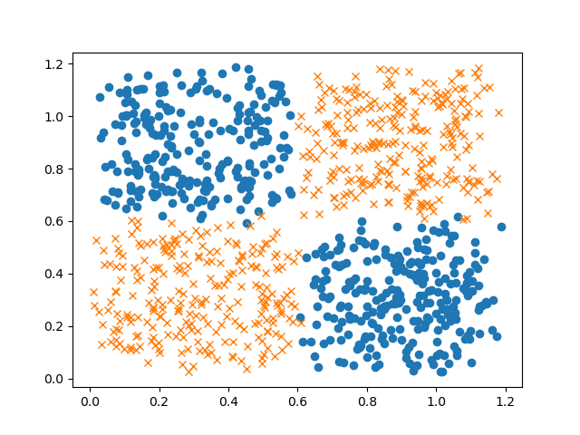
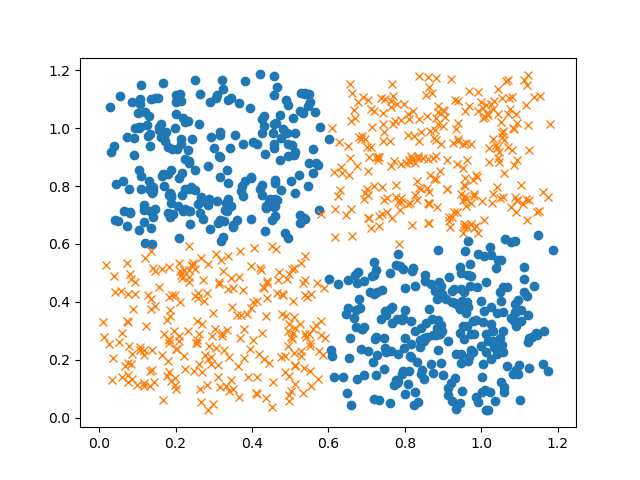

# PoPL (Principles of Programming Languages), CS F301 Course Project

## Title : Comparative Study between PyRo and other DL frameworks
## Members : Karan Bania (2021A7PS2582G), Nishant Bhandari (2021A7PS2046G)

### Software used (major parts): 
1. <a href="https://github.com/HIPSautograd">`autograd` library</a>
2. <a href="https://pyro.ai/">the `PyRo` framework</a>
3. <a href="https://numpy.org/">`numpy` library</a>

### Reults:

#### We tried out different noise scales to see how tough it can get for the models to fit the data and verify that they are working as expected. Almost same results using both libraries.
#### Noise Code:
```
x += torch.rand((num_samples, 2)) / scale  # add some noise at the edges of each class block
```
#### For numpy,
| Noise scale (lower => high noise) | (avg. %) Accuracy on test set accross 3 seeds |
| --------------------------------- | ------------------------------------------- |
| 8 | 99 |
| 4 | 94 |
| 2 | 82.5 |

#### For pyro,
| Noise scale (lower => high noise) | (avg. %) Accuracy on test set accross 3 seeds |
| --------------------------------- | ------------------------------------------- |
| - | - |
| - | - |
| - | - |

### Graphs:

Data at scale = 8 vs Predictions at scale = 8<br>
| Data | Predictions |
:---: | :---------: |
|  |  |