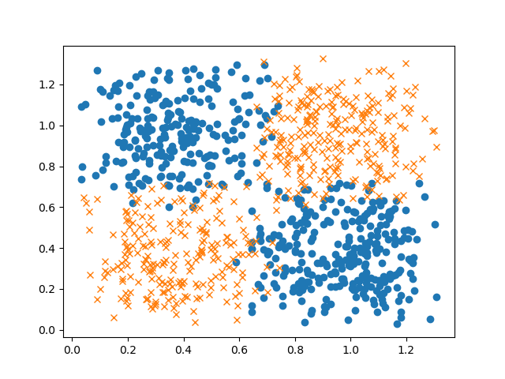

# PoPL (Principles of Programming Languages), CS F301 Course Project

## Title : Comparative Study between PyRo and other DL frameworks
## Members : Karan Bania (2021A7PS2582G), Nishant Bhandari (2021A7PS2046G)

### Software used (major parts): 
1. <a href="https://github.com/HIPSautograd">`autograd` library</a>
2. <a href="https://pyro.ai/">the `PyRo` framework</a>
3. <a href="https://numpy.org/">`numpy` library</a>
4. <a href="https://pytorch.org/">`PyTorch` library</a>

### Model Architecture:

Input -> Feed-Forward -> ReLU -> Feed-Forward -> Sigmoid <br>
(m, 2) -> (2, 4) -> (m, 4) -> (4, 1) -> (m, 1)

### Who did what:

#### Karan worked on the numpy code whereas Nishant worked on the PyRo side of things. We would code together and explain nuances of each library to each other.

### Reults:

#### We tried out different noise scales to see how tough it can get for the models to fit the data and verify that they are working as expected. Almost same results using both libraries.

#### Noise Code:
```
x += torch.rand((num_samples, 2)) / scale  # add some noise at the edges of each class block
```
#### For numpy,
| Noise scale (lower => high noise) | (avg. %) Accuracy on test set accross 3 seeds |
| --------------------------------- | ------------------------------------------- |
| 8 | 99 |
| 4 | 94 |
| 2 | 82.5 |

#### For pyro,
| Noise scale (lower => high noise) | (avg. %) Accuracy on test set accross 3 seeds |
| --------------------------------- | ------------------------------------------- |
| 8 | 98.6 |
| 4 | 94.7 |
| 2 | 82.5 |

### Graphs:

#### scale = 8 <br>
| Data | Predictions numpy | Predictions pyro |
| :---: | :---------: | :-: |
|  |  |  |

| Learning Graph numpy | Learning Graph pyro |
| :-: | :-: |
|  |  |

#### scale = 4 <br>
| Data | Predictions numpy | Predictions pyro |
:---: | :---------: | :-: |
|  |  |  |

| Learning Graph numpy | Learning Graph pyro |
| :-: | :-: |
|  |  |

#### scale = 2 <br>
| Data | Predictions numpy | Predictions pyro |
:---: | :---------: | :-: |
|  |  |  |

| Learning Graph numpy | Learning Graph pyro |
| :-: | :-: |
|  |  |